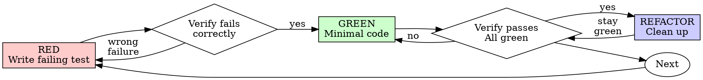

# Test-Driven Development (TDD)

## Overview

Write the test first. Watch it fail. Write minimal code to pass.

**Core principle:** If you didn't watch the test fail, you don't know if it tests the right thing.

**Violating the letter of the rules is violating the spirit of the rules.**

## When to Use

**Always:**
- New features
- Bug fixes
- Refactoring
- Behavior changes

**Exceptions (ask your human partner):**
- Throwaway prototypes
- Generated code
- Configuration files

Thinking "skip TDD just this once"? Stop. That's rationalization.

## The Iron Law

```
NO PRODUCTION CODE WITHOUT A FAILING TEST FIRST
```

Write code before the test? Delete it. Start over.

**No exceptions:**
- Don't keep it as "reference"
- Don't "adapt" it while writing tests
- Don't look at it
- Delete means delete

Implement fresh from tests. Period.

## Red-Green-Refactor



### RED - Write Failing Test

Write one minimal test showing what should happen.

<Good>
```zig
test "retries failed operations 3 times" {
    var attempts: u32 = 0;
    const result = retryOperation(&attempts);
    try std.testing.expectEqual(@as(u32, 3), attempts);
    try std.testing.expect(result != null);
}
```
Clear name, tests real behavior, one thing
</Good>

<Bad>
```zig
test "retry works" {
    // Vague name, no clear assertion about behavior
    const result = retryOperation(null);
    try std.testing.expect(result != null);
}
```
Vague name, doesn't verify retry count or behavior
</Bad>

**Requirements:**
- One behavior
- Clear name
- Real code (no fakes unless unavoidable)

### Verify RED - Watch It Fail

**MANDATORY. Never skip.**

```bash
zig build test
```

Confirm:
- Test fails (not compile errors)
- Failure message is expected
- Fails because feature missing (not typos)

**Test passes?** You're testing existing behavior. Fix test.

**Test errors?** Fix error, re-run until it fails correctly.

### GREEN - Minimal Code

Write simplest code to pass the test.

<Good>
```zig
fn retryOperation(attempts: *u32) ?[]const u8 {
    for (0..3) |i| {
        attempts.* += 1;
        if (doOperation()) |result| return result;
        if (i == 2) return null;
    }
    return null;
}
```
Just enough to pass
</Good>

<Bad>
```zig
const RetryConfig = struct {
    max_retries: u32 = 3,
    backoff_ms: u64 = 100,
    backoff_strategy: enum { linear, exponential } = .linear,
    on_retry: ?*const fn(u32) void = null,
};

fn retryOperation(config: RetryConfig) ![]const u8 {
    // YAGNI - over-engineered
}
```
Over-engineered
</Bad>

Don't add features, refactor other code, or "improve" beyond the test.

### Verify GREEN - Watch It Pass

**MANDATORY.**

```bash
zig build test
```

Confirm:
- Test passes
- Other tests still pass
- Output pristine (no errors, warnings)

**Test fails?** Fix code, not test.

**Other tests fail?** Fix now.

### REFACTOR - Clean Up

After green only:
- Remove duplication
- Improve names
- Extract helpers

Keep tests green. Don't add behavior.

### Repeat

Next failing test for next feature.

## Good Tests

| Quality | Good | Bad |
|---------|------|-----|
| **Minimal** | One thing. "and" in name? Split it. | `test "validates email and domain and whitespace"` |
| **Clear** | Name describes behavior | `test "test1"` |
| **Shows intent** | Demonstrates desired API | Obscures what code should do |

## Why Order Matters

**"I'll write tests after to verify it works"**

Tests written after code pass immediately. Passing immediately proves nothing:
- Might test wrong thing
- Might test implementation, not behavior
- Might miss edge cases you forgot
- You never saw it catch the bug

Test-first forces you to see the test fail, proving it actually tests something.

**"I already manually tested all the edge cases"**

Manual testing is ad-hoc. You think you tested everything but:
- No record of what you tested
- Can't re-run when code changes
- Easy to forget cases under pressure
- "It worked when I tried it" ≠ comprehensive

Automated tests are systematic. They run the same way every time.

**"Deleting X hours of work is wasteful"**

Sunk cost fallacy. The time is already gone. Your choice now:
- Delete and rewrite with TDD (X more hours, high confidence)
- Keep it and add tests after (30 min, low confidence, likely bugs)

The "waste" is keeping code you can't trust. Working code without real tests is technical debt.

**"TDD is dogmatic, being pragmatic means adapting"**

TDD IS pragmatic:
- Finds bugs before commit (faster than debugging after)
- Prevents regressions (tests catch breaks immediately)
- Documents behavior (tests show how to use code)
- Enables refactoring (change freely, tests catch breaks)

"Pragmatic" shortcuts = debugging in production = slower.

**"Tests after achieve the same goals - it's spirit not ritual"**

No. Tests-after answer "What does this do?" Tests-first answer "What should this do?"

Tests-after are biased by your implementation. You test what you built, not what's required. You verify remembered edge cases, not discovered ones.

Tests-first force edge case discovery before implementing. Tests-after verify you remembered everything (you didn't).

30 minutes of tests after ≠ TDD. You get coverage, lose proof tests work.

## Common Rationalizations

| Excuse | Reality |
|--------|---------|
| "Too simple to test" | Simple code breaks. Test takes 30 seconds. |
| "I'll test after" | Tests passing immediately prove nothing. |
| "Tests after achieve same goals" | Tests-after = "what does this do?" Tests-first = "what should this do?" |
| "Already manually tested" | Ad-hoc ≠ systematic. No record, can't re-run. |
| "Deleting X hours is wasteful" | Sunk cost fallacy. Keeping unverified code is technical debt. |
| "Keep as reference, write tests first" | You'll adapt it. That's testing after. Delete means delete. |
| "Need to explore first" | Fine. Throw away exploration, start with TDD. |
| "Test hard = design unclear" | Listen to test. Hard to test = hard to use. |
| "TDD will slow me down" | TDD faster than debugging. Pragmatic = test-first. |
| "Manual test faster" | Manual doesn't prove edge cases. You'll re-test every change. |
| "Existing code has no tests" | You're improving it. Add tests for existing code. |

## Red Flags - STOP and Start Over

- Code before test
- Test after implementation
- Test passes immediately
- Can't explain why test failed
- Tests added "later"
- Rationalizing "just this once"
- "I already manually tested it"
- "Tests after achieve the same purpose"
- "It's about spirit not ritual"
- "Keep as reference" or "adapt existing code"
- "Already spent X hours, deleting is wasteful"
- "TDD is dogmatic, I'm being pragmatic"
- "This is different because..."

**All of these mean: Delete code. Start over with TDD.**

## Example: Bug Fix

**Bug:** Empty mermaid code block causes crash

**RED**
```zig
test "empty mermaid code block returns null diagram" {
    const allocator = std.testing.allocator;
    const result = try detector.detect(allocator, "");
    try std.testing.expect(result == null);
}
```

**Verify RED**
```bash
$ zig build test
1/1 test "empty mermaid code block returns null diagram"...FAIL
Expected null, found .flowchart
```

**GREEN**
```zig
pub fn detect(allocator: Allocator, content: []const u8) !?DiagramType {
    if (content.len == 0) return null;
    // ... existing detection logic
}
```

**Verify GREEN**
```bash
$ zig build test
All 42 tests passed.
```

**REFACTOR**
Extract validation for multiple input checks if needed.

## Zig Testing Patterns

### Basic test structure
```zig
const std = @import("std");
const testing = std.testing;

test "descriptive name of behavior" {
    // Arrange
    const allocator = testing.allocator; // Detects leaks!

    // Act
    const result = try myFunction(allocator, input);
    defer allocator.free(result);

    // Assert
    try testing.expectEqual(expected, result);
    try testing.expectEqualStrings("expected", actual);
    try testing.expect(condition);
}
```

### Common assertions
```zig
try testing.expectEqual(expected, actual);       // Value equality
try testing.expectEqualStrings("abc", slice);    // String comparison
try testing.expect(boolean_condition);            // Boolean check
try testing.expectError(error.OutOfMemory, expr); // Error expected
try testing.expectFmt("formatted", "{}", .{val}); // Format check
```

### Testing with allocators
Zig's `testing.allocator` automatically detects memory leaks — use it for all tests that allocate.

## Verification Checklist

Before marking work complete:

- [ ] Every new function/method has a test
- [ ] Watched each test fail before implementing
- [ ] Each test failed for expected reason (feature missing, not typo)
- [ ] Wrote minimal code to pass each test
- [ ] All tests pass (`zig build test`)
- [ ] Output pristine (no errors, warnings)
- [ ] Tests use real code (fakes only if unavoidable)
- [ ] Edge cases and errors covered
- [ ] No memory leaks (testing.allocator catches these)

Can't check all boxes? You skipped TDD. Start over.

## When Stuck

| Problem | Solution |
|---------|----------|
| Don't know how to test | Write wished-for API. Write assertion first. Ask your human partner. |
| Test too complicated | Design too complicated. Simplify interface. |
| Hard to isolate | Pass dependencies as parameters (Zig favors explicit over implicit). |
| Test setup huge | Extract helpers. Still complex? Simplify design. |

## Debugging Integration

Bug found? Write failing test reproducing it. Follow TDD cycle. Test proves fix and prevents regression.

Never fix bugs without a test.

## Testing Anti-Patterns

When writing tests, read @testing-anti-patterns.md to avoid common pitfalls:
- Testing setup behavior instead of real behavior
- Adding test-only methods to production structs
- Over-complex test fixtures

## Final Rule

```
Production code → test exists and failed first
Otherwise → not TDD
```

No exceptions without your human partner's permission.
