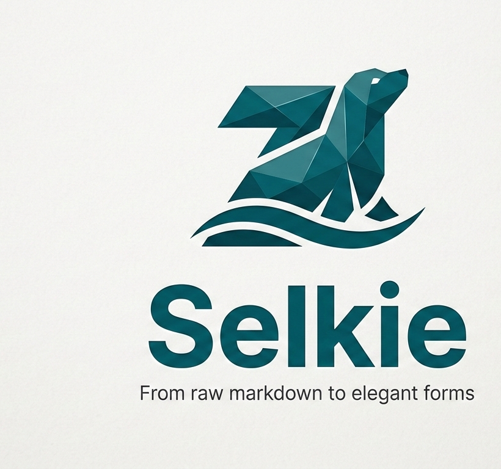

<p align="center">
  
</p>

# Selkie

A fast, native markdown viewer for Linux with GFM support, Mermaid chart rendering, and theming. Built with Zig and raylib.

## Features

- **GitHub Flavored Markdown** — tables, task lists, strikethrough, autolinks, footnotes
- **Mermaid Diagrams** — native rendering of flowcharts, sequence, class, state, ER, Gantt, pie, mindmap, gitgraph, journey, and timeline diagrams
- **Tabs** — open multiple files simultaneously
- **Theming** — built-in light/dark themes, custom theme JSON support
- **Vim-style Navigation** — `j`/`k` scroll, `gg`/`G` jump, `/` search, `:` command mode
- **Stdin Support** — pipe markdown directly (`cat file.md | selkie`)
- **Live Reload** — auto-refreshes when the file changes on disk
- **PDF Export** — export rendered documents to PDF
- **Table of Contents** — sidebar navigation for document headings

## Installation

### Package Repositories

```bash
# Debian/Ubuntu (APT)
curl -fsSL https://aaddrick.github.io/selkie/KEY.gpg | sudo gpg --dearmor -o /usr/share/keyrings/selkie.gpg
echo "deb [signed-by=/usr/share/keyrings/selkie.gpg arch=amd64,arm64] https://aaddrick.github.io/selkie stable main" | sudo tee /etc/apt/sources.list.d/selkie.list
sudo apt update && sudo apt install selkie

# Fedora/RHEL (DNF)
sudo curl -fsSL https://aaddrick.github.io/selkie/rpm/selkie.repo -o /etc/yum.repos.d/selkie.repo
sudo dnf install selkie

# Arch Linux (AUR)
yay -S selkie
```

Pre-built `.deb`, `.rpm`, and `.AppImage` files are also available on the [Releases page](https://github.com/aaddrick/selkie/releases).

For all installation methods (Nix, AppImage, building from source), see [docs/INSTALL.md](docs/INSTALL.md).

## Usage

```bash
selkie file.md                   # Open a file
selkie *.md                      # Open multiple files in tabs
selkie --dark file.md            # Use dark theme
selkie --theme custom.json file.md  # Use custom theme
cat README.md | selkie           # Read from stdin
```

See `selkie --help` or `man selkie` for full options and keybindings.

## Building from Source

Requires [Zig 0.14.1](https://ziglang.org/download/) and system X11/Wayland/GL development libraries.

```bash
zig build                        # Debug build
zig build -Doptimize=ReleaseSafe # Release build
zig build test                   # Run tests
```

See [docs/BUILDING.md](docs/BUILDING.md) for platform-specific dependency installation.

## License

MIT — see [LICENSE](LICENSE).
