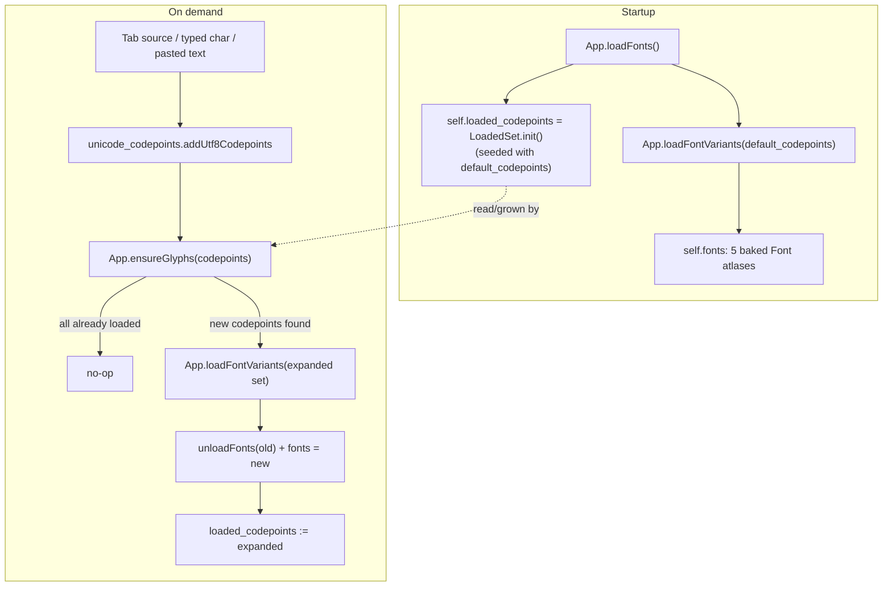
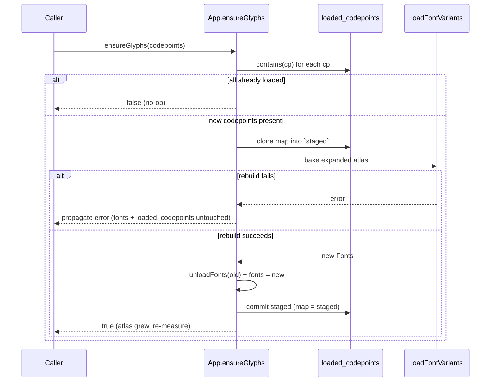
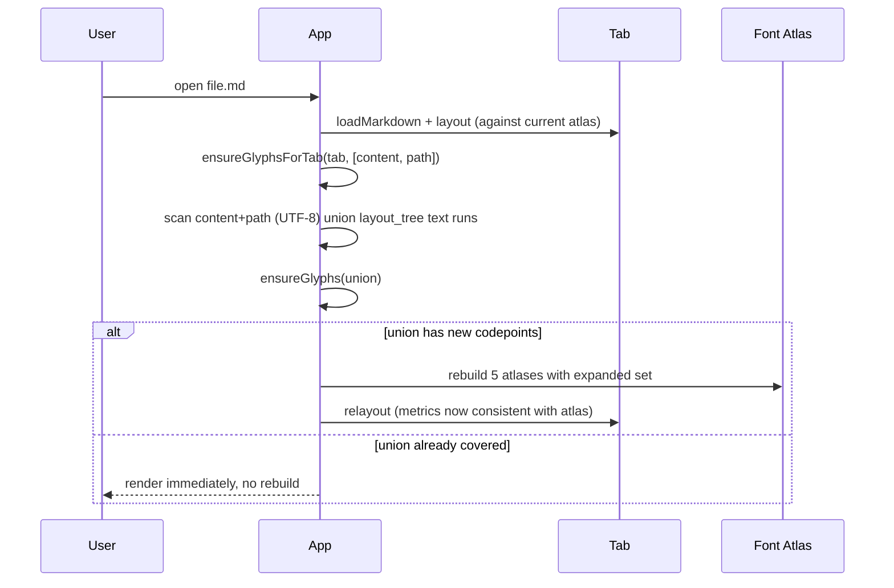

# Font Atlas Loading

> How Selkie bakes glyphs into font atlases at startup, and grows them
> on demand as documents and user input need codepoints beyond the
> eager default set.

## Overview

Each of Selkie's 5 font variants (regular/bold/italic/bold-italic/mono) is
backed by a raylib `Font`, which bakes a fixed set of Unicode codepoints
into a GPU texture atlas at load time (`rl.loadFontEx`). Historically this
set was the full ~2,135-codepoint table in
[`unicode_codepoints.zig`](../src/unicode_codepoints.zig), baked
unconditionally on every startup regardless of what the opened document
actually needed — a fixed cost that dominated idle memory (see
[Memory Profiling — Issue #77](memory-profiling.md) for the measurements
that motivated this change).

This document describes the tiered eager/lazy loading scheme that replaced
that: a small default set is baked at startup, and the remainder is loaded
only when a document or user input actually requires it.

## Architecture

Two codepoint tables in `src/unicode_codepoints.zig` partition the same
Unicode range coverage that used to be one flat table:

| Table | Codepoints | When loaded |
|-------|-----------:|--------------|
| `default_codepoints` | 303 | Eagerly, every `App.loadFonts()` call (startup, theme reload) |
| `remainder_codepoints` | ~1,832 | Lazily, only via `App.ensureGlyphs` when actually needed |

`default_ranges` covers Basic Latin, Latin-1 Supplement, and General
Punctuation — enough for plain English/Western-European prose with curly
quotes and em dashes on the first frame with no rebuild. `remainder_ranges`
covers everything else the old single table had: Latin Extended-A/B, Greek,
super/subscripts, currency, letterlike symbols, arrows, math operators,
misc technical, geometric shapes, misc symbols, dingbats, ligatures, and
the replacement character.

## Components

### `unicode_codepoints.LoadedSet`

Growth-only record of which codepoints are currently baked into
`App.fonts`. Backed by `std.AutoHashMap(i32, void)`.

| Method | Behavior |
|--------|----------|
| `init(allocator)` | Seeds the set with all of `default_codepoints` |
| `contains(cp)` | O(1) membership check |
| `add(cp)` | Inserts `cp`; returns whether it was new |
| `deinit()` | Frees the backing map |

It only ever grows, mirroring the fact that an atlas rebuild is always
"old set plus new codepoints," never a shrink — there's no use case for
evicting glyphs mid-session.

### `App.loadFontVariants(codepoints)`

Bakes all 5 font variants at the fixed 32px size from `assets/fonts/`
using the given codepoint slice, returning a `Fonts` value without
touching `self.fonts`. Callers decide when to swap it in, so a failed
rebuild never leaves `self.fonts` null. Any variant baked before a later
failure in the same call is unloaded via `errdefer`.

### `App.loadFonts()`

The startup path: bakes `default_codepoints` only, and (re)seeds
`self.loaded_codepoints` to track that set. Called from `main.zig` after
window/GL init and on theme reload.

### `App.ensureGlyphs(codepoints) !bool`

The core lazy-loading entry point. Given a slice of codepoints:

1. Cheap pre-check against `LoadedSet.contains` — if every codepoint is
   already loaded, returns `false` with no allocation.
2. Otherwise stages growth in a **clone** of `loaded_codepoints`'s map
   (`self.fonts == null` — no atlas exists yet — skips staging and commits
   directly, since there's nothing to fall out of sync with).
3. Rebuilds all 5 atlases via `loadFontVariants` with the expanded set.
4. Only after the rebuild succeeds: unloads the old atlas, swaps in the
   new one, and commits the staged set into `loaded_codepoints`.

Returns `true` if the atlas grew (callers that measure text, e.g. before
a relayout, must treat this as "stale metrics, re-measure"), `false` if
it was a no-op.

### `App.ensureGlyphsForTab(tab, sources)`

Document-load integration point, called from `newTabWithFile` (with the
markdown source and file path — the path is scanned because it becomes
the tab title, drawn with the same atlas) and `loadMarkdownDirect` (stdin
path).

Collects the codepoint union of:
- A raw UTF-8 scan of `sources` (covers prose, code, tables, headings,
  and literal Mermaid node/edge/title text, since Mermaid labels are
  plain text inside the fenced source).
- A walk of the tab's `layout_tree` text runs (covers glyphs with no
  literal source representation, e.g. math symbols synthesized from
  LaTeX during layout).

Calls `ensureGlyphs` with the union, and relayouts the tab once if it
returned `true` — mirroring the existing double-relayout pattern already
used for details-state restoration.

### Runtime hooks: `ensureGlyphForChar` / `ensureGlyphsForBytes`

Called from the editor, search, and command-palette input handlers:

- `ensureGlyphForChar(codepoint)` — one codepoint at a time, from
  `rl.getCharPressed()` (already decoded, so no UTF-8 scan needed).
- `ensureGlyphsForBytes(inserted)` — a UTF-8 byte slice, from editor
  paste (clipboard content arrives as raw bytes, not one char at a time).

Neither triggers a relayout directly: the editor's existing
`edit_version`-driven live-preview reparse (checked every frame in
`update()`) re-measures against the atlas on the same frame, since these
hooks run earlier in the frame than that check.

## Data Flow — opening a document

## Key Types

| Type | Location | Role |
|------|----------|------|
| `LoadedSet` | `src/unicode_codepoints.zig` | Growth-only record of baked codepoints |
| `default_codepoints` / `remainder_codepoints` | `src/unicode_codepoints.zig` | Comptime-built codepoint tables (303 / ~1,832) |
| `App.loaded_codepoints: ?LoadedSet` | `src/app.zig` | Per-app instance of `LoadedSet`; `null` until `loadFonts` runs |
| `App.fonts: ?Fonts` | `src/app.zig` | The 5 baked `raylib.Font` atlases currently in use |

## Invariants

- **`loaded_codepoints` never shrinks.** Codepoints are only ever added;
  there is no eviction path.
- **A failed rebuild never tears down a working atlas.** `loadFontVariants`
  builds the replacement fully before `ensureGlyphs` calls `unloadFonts`
  on the old one; if baking fails, the error propagates before either the
  swap or the `loaded_codepoints` commit happens.
- **Growth is staged, not applied speculatively.** `ensureGlyphs` clones
  `loaded_codepoints`'s map into a scratch copy and only writes it back
  after the atlas rebuild that describes it has actually succeeded —
  otherwise a failed rebuild would permanently mark codepoints "loaded"
  with no glyph ever baked for them, blocking any future retry.
- **One rebuild per call, never proliferating atlases.** All 5 variants
  are rebuilt together from the full expanded set, not incrementally
  patched — raylib has no API to add glyphs to an existing atlas texture.

## Error Handling

`ensureGlyphs` and `loadFontVariants` return Zig error unions and
propagate allocation/font-loading failures to callers. The three
`App`-level integration points (`ensureGlyphsForTab`,
`ensureGlyphForChar`, `ensureGlyphsForBytes`) are frame-loop callers that
cannot themselves fail the frame, so they catch and `std.log.err` rather
than propagating — consistent with the rest of `App`'s per-frame update
path (see `relayoutActiveTab` for the same pattern).

## Configuration

The default/remainder split is fixed at comptime in
`src/unicode_codepoints.zig` (`default_ranges` / `remainder_ranges`); there
is no runtime or theme-level configuration for it. Changing which
codepoints are eager vs. lazy means editing those range tables and
re-running the `unicode_codepoints.zig` test block, which pins exact
counts (`default_codepoints.len == 303`) to catch accidental range drift.

## Decision Log

The eager/lazy split, the 303-codepoint default set, and the measured
memory impact are recorded in
[Memory Profiling — Issue #77](memory-profiling.md), including the
atlas-isolation experiment that justified building this mechanism and the
BEFORE/AFTER RSS comparison after it shipped.

## References

- [Memory Profiling — Issue #77](memory-profiling.md) — profiling
  procedure, BEFORE/AFTER results, go/no-go rationale
- [`src/unicode_codepoints.zig`](../src/unicode_codepoints.zig) —
  codepoint tables, `LoadedSet`, UTF-8 scanning helpers
- [`src/app.zig`](../src/app.zig) — `loadFonts`, `ensureGlyphs`,
  `ensureGlyphsForTab`, runtime hooks
- `CLAUDE.md` — project-wide memory management and error-handling
  conventions this module follows
