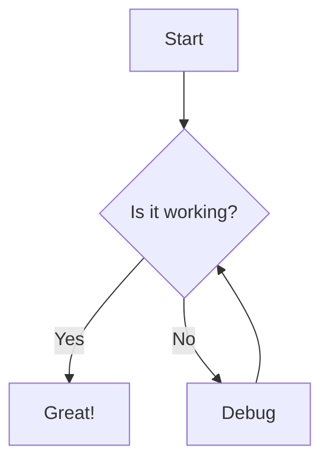
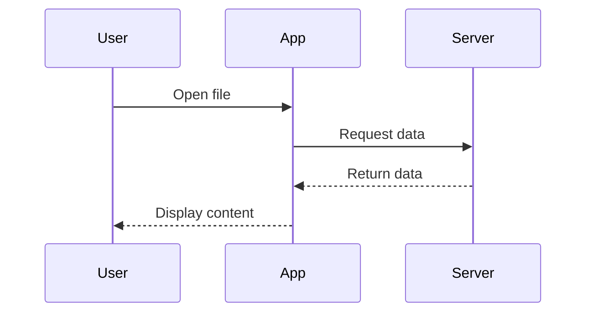
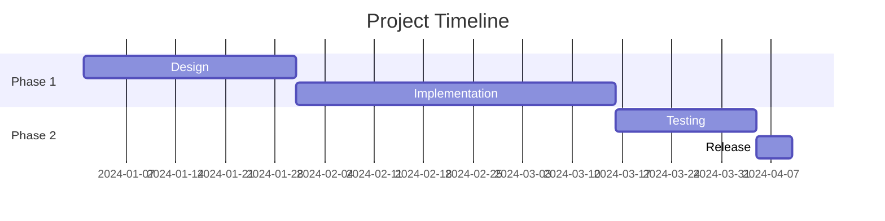
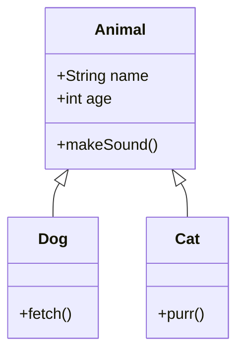
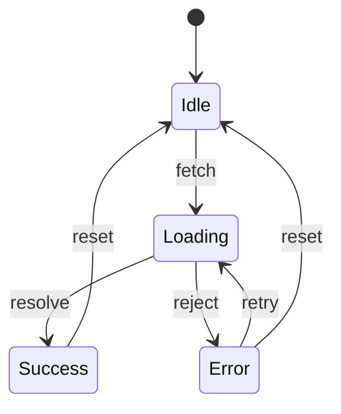
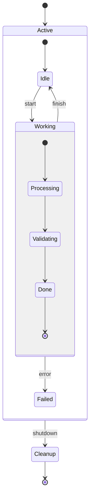
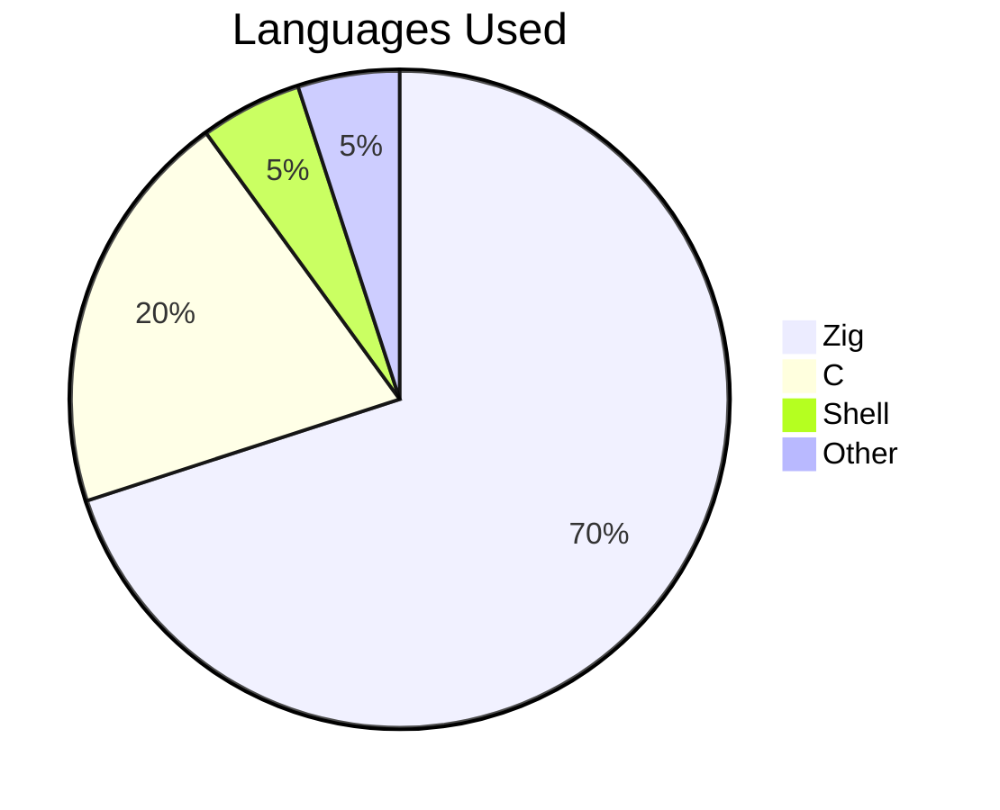

# GitHub Markdown Feature Samples

A comprehensive showcase of all GitHub Flavored Markdown (GFM) features. Useful as a
test document for Selkie's markdown rendering.

---

## Table of Contents

- [Headings](#headings)
- [Text Formatting](#text-formatting)
- [Blockquotes](#blockquotes)
- [Lists](#lists)
- [Task Lists](#task-lists)
- [Links](#links)
- [Images](#images)
- [Code](#code)
- [Tables](#tables)
- [Horizontal Rules](#horizontal-rules)
- [Alerts / Admonitions](#alerts--admonitions)
- [Footnotes](#footnotes)
- [Math Expressions](#math-expressions)
- [Diagrams (Mermaid)](#diagrams-mermaid)
- [GeoJSON / TopoJSON Maps](#geojson--topojson-maps)
- [STL 3D Models](#stl-3d-models)
- [Emoji](#emoji)
- [Mentions and References](#mentions-and-references)
- [Collapsed Sections](#collapsed-sections)
- [Definition Lists](#definition-lists)
- [Subscript and Superscript](#subscript-and-superscript)
- [Autolinks](#autolinks)
- [Escaping](#escaping)
- [HTML in Markdown](#html-in-markdown)
- [Keyboard Keys](#keyboard-keys)
- [Color Chips](#color-chips)

---

## Headings

# Heading 1
## Heading 2
### Heading 3
#### Heading 4
##### Heading 5
###### Heading 6

Alternative syntax for H1 and H2:

Heading 1 Alt
==============

Heading 2 Alt
--------------

---

## Text Formatting

| Style | Syntax | Result |
|-------|--------|--------|
| Bold | `**bold**` | **bold** |
| Italic | `*italic*` | *italic* |
| Bold + Italic | `***bold italic***` | ***bold italic*** |
| Strikethrough | `~~strikethrough~~` | ~~strikethrough~~ |
| Subscript | `H<sub>2</sub>O` | H<sub>2</sub>O |
| Superscript | `x<sup>2</sup>` | x<sup>2</sup> |

You can also use underscores for _italic_ and __bold__.

Inline `code` is formatted with backticks.

---

## Blockquotes

> This is a blockquote.

> Blockquotes can span
> multiple lines.

> Nested blockquotes:
>
> > are also supported.
> >
> > > And can go multiple levels deep.

> Blockquotes can contain **other formatting**, `inline code`, and
> - even
> - lists

---

## Lists

### Unordered Lists

- Item 1
- Item 2
  - Nested item 2a
  - Nested item 2b
    - Deeply nested item
- Item 3

Alternative markers:

* Asterisk item
+ Plus item
- Dash item

### Ordered Lists

1. First item
2. Second item
   1. Sub-item 2.1
   2. Sub-item 2.2
3. Third item

Ordered lists with arbitrary numbers:

1. First
1. Still second (GitHub auto-numbers)
1. Still third

Starting from a specific number:

5. Fifth
6. Sixth
7. Seventh

### Mixed Lists

1. Ordered item
   - Unordered sub-item
   - Another sub-item
2. Next ordered item
   1. Ordered sub-item
      - Mixed deeper

### Lists with Paragraphs

- Item with a paragraph below.

  This paragraph is part of the list item. It must be indented.

- Another item with multiple paragraphs.

  First paragraph.

  Second paragraph.

---

## Task Lists

- [x] Completed task
- [ ] Incomplete task
- [x] Another completed task
  - [ ] Nested incomplete task
  - [x] Nested completed task

---

## Links

### Inline Links

[GitHub](https://github.com)

[GitHub with title](https://github.com "GitHub Homepage")

### Reference Links

[GitHub][gh-link]
[Another reference][1]

[gh-link]: https://github.com
[1]: https://github.com/about "GitHub About Page"

### Relative Links

[Building Instructions](BUILDING.md)

[Go to headings section](#headings)

### Bare URLs (Autolinks)

https://github.com

<https://github.com>

### Email Autolinks

<user@example.com>

---

## Images

### Inline Image


### Reference Image

![Alt text][img-ref]

[img-ref]: https://via.placeholder.com/150

### Image with Link

[](https://github.com)

### Specifying Theme Context for Images

GitHub supports light/dark theme images using the HTML `picture` element:

<picture>
  <source media="(prefers-color-scheme: dark)" srcset="https://via.placeholder.com/150/000/fff?text=Dark">
  <source media="(prefers-color-scheme: light)" srcset="https://via.placeholder.com/150/fff/000?text=Light">
  
</picture>

---

## Code

### Inline Code

Use `git status` to check the working tree.

To escape backticks inside inline code, use double backticks: ``code with `backtick` inside``.

### Fenced Code Blocks

```
Plain code block without language specification.
No syntax highlighting applied.
```

### Syntax Highlighted Code Blocks

```python
def greet(name: str) -> str:
    """Return a greeting."""
    return f"Hello, {name}!"

if __name__ == "__main__":
    print(greet("World"))
```

```javascript
const fibonacci = (n) => {
  if (n <= 1) return n;
  return fibonacci(n - 1) + fibonacci(n - 2);
};

console.log(fibonacci(10)); // 55
```

```rust
fn main() {
    let numbers = vec![1, 2, 3, 4, 5];
    let sum: i32 = numbers.iter().sum();
    println!("Sum: {}", sum);
}
```

```zig
const std = @import("std");

pub fn main() !void {
    const stdout = std.io.getStdOut().writer();
    try stdout.print("Hello, {s}!\n", .{"world"});
}
```

```bash
#!/bin/bash
for i in {1..5}; do
    echo "Iteration $i"
done
```

```json
{
  "name": "selkie",
  "version": "0.1.0",
  "features": ["markdown", "mermaid", "themes"]
}
```

```yaml
project:
  name: selkie
  language: zig
  dependencies:
    - raylib
    - cmark-gfm
```

```diff
- old line removed
+ new line added
  unchanged line
```

```csv
Name,Age,City
Alice,30,Portland
Bob,25,Seattle
```

### Indented Code Block

    This is an indented code block.
    Each line is indented by at least 4 spaces.
    No syntax highlighting is applied.

---

## Tables

### Basic Table

| Header 1 | Header 2 | Header 3 |
|----------|----------|----------|
| Cell 1   | Cell 2   | Cell 3   |
| Cell 4   | Cell 5   | Cell 6   |

### Aligned Table

| Left-aligned | Center-aligned | Right-aligned |
|:-------------|:--------------:|--------------:|
| Left         | Center         | Right         |
| Text         | Text           | Text          |
| More         | More           | More          |

### Table with Formatting

| Feature | Status | Notes |
|---------|--------|-------|
| **Bold** | ~~removed~~ | `code` |
| *Italic* | [Link](https://github.com) | Normal |

### Table with Pipes in Content

| Output | Command |
|--------|---------|
| `\|` escaped pipe | Use `\|` to escape |

---

## Horizontal Rules

Three or more hyphens:

---

Three or more asterisks:

***

Three or more underscores:

___

---

## Alerts / Admonitions

> [!NOTE]
> Useful information that users should know, even when skimming content.

> [!TIP]
> Helpful advice for doing things better or more easily.

> [!IMPORTANT]
> Key information users need to know to achieve their goal.

> [!WARNING]
> Urgent info that needs immediate user attention to avoid problems.

> [!CAUTION]
> Advises about risks or negative outcomes of certain actions.

---

## Footnotes

Here is a sentence with a footnote.[^1]

Here is another with a named footnote.[^note]

[^1]: This is the first footnote.
[^note]: This is the named footnote. It can contain **formatting** and
    even multiple paragraphs if subsequent lines are indented.

    Second paragraph of the named footnote.

---

## Math Expressions

### Inline Math

The quadratic formula is $x = \frac{-b \pm \sqrt{b^2 - 4ac}}{2a}$ and is widely used.

Einstein's famous equation: $E = mc^2$

### Block Math (Dollar Signs)

$$
\int_0^\infty e^{-x^2} dx = \frac{\sqrt{\pi}}{2}
$$

$$
\sum_{n=1}^{\infty} \frac{1}{n^2} = \frac{\pi^2}{6}
$$

### Block Math (Code Block Syntax)

```math
\left(\begin{array}{cc}
a & b \\
c & d
\end{array}\right)
\times
\left(\begin{array}{c}
x \\
y
\end{array}\right)
=
\left(\begin{array}{c}
ax + by \\
cx + dy
\end{array}\right)
```

---

## Diagrams (Mermaid)

### Flowchart



### Sequence Diagram



### Gantt Chart



### Class Diagram



### State Diagram



### Nested State Diagram (2-level composite states)



### Pie Chart



### Git Graph

```mermaid
gitgraph
    commit
    commit
    branch feature
    checkout feature
    commit
    commit
    checkout main
    merge feature
    commit
```

---

## GeoJSON / TopoJSON Maps

### GeoJSON

```geojson
{
  "type": "FeatureCollection",
  "features": [
    {
      "type": "Feature",
      "geometry": {
        "type": "Point",
        "coordinates": [-122.4194, 37.7749]
      },
      "properties": {
        "name": "San Francisco"
      }
    }
  ]
}
```

### TopoJSON

```topojson
{
  "type": "Topology",
  "objects": {
    "example": {
      "type": "GeometryCollection",
      "geometries": [
        {
          "type": "Point",
          "coordinates": [0, 0],
          "properties": {
            "name": "Origin"
          }
        }
      ]
    }
  }
}
```

---

## STL 3D Models

```stl
solid cube
  facet normal 0 0 -1
    outer loop
      vertex 0 0 0
      vertex 1 0 0
      vertex 1 1 0
    endloop
  endfacet
  facet normal 0 0 -1
    outer loop
      vertex 0 0 0
      vertex 1 1 0
      vertex 0 1 0
    endloop
  endfacet
  facet normal 0 0 1
    outer loop
      vertex 0 0 1
      vertex 1 1 1
      vertex 1 0 1
    endloop
  endfacet
  facet normal 0 0 1
    outer loop
      vertex 0 0 1
      vertex 0 1 1
      vertex 1 1 1
    endloop
  endfacet
endsolid cube
```

---

## Emoji

### Emoji Shortcodes

:smile: :rocket: :octocat: :+1: :-1: :heart: :fire: :star: :warning: :bulb:

:white_check_mark: :x: :arrow_right: :tada: :construction: :bug: :memo: :lock:

### Unicode Emoji

Direct Unicode emoji also work: :thumbsup: :thumbsdown:

---

## Mentions and References

### User and Team Mentions

@username mentions a user (renders as a link on GitHub).

@org/team-name mentions a team.

### Issue and PR References

#123 references an issue or PR in the current repo.

user/repo#123 references an issue or PR in another repo.

GH-123 also references an issue (alternative syntax).

### Commit References

Full SHA: a1b2c3d4e5f6a1b2c3d4e5f6a1b2c3d4e5f6a1b2

Short SHA: a1b2c3d

user/repo@a1b2c3d references a commit in another repo.

---

## Collapsed Sections

<details>
<summary>Click to expand this section</summary>

This content is hidden by default. It can contain any markdown:

- Lists
- **Bold text**
- `Code`

```python
print("Even code blocks!")
```

</details>

<details>
<summary>Another collapsed section with a table</summary>

| Column A | Column B |
|----------|----------|
| Data 1   | Data 2   |
| Data 3   | Data 4   |

</details>

<details open>
<summary>This section is open by default</summary>

Using the `open` attribute makes the section expanded initially.

</details>

---

## Definition Lists

GitHub renders definition lists using HTML:

<dl>
  <dt>Markdown</dt>
  <dd>A lightweight markup language for creating formatted text.</dd>

  <dt>GFM</dt>
  <dd>GitHub Flavored Markdown. A superset of CommonMark with GitHub-specific extensions.</dd>

  <dt>Selkie</dt>
  <dd>A Zig-based GUI markdown viewer with GFM support and native Mermaid rendering.</dd>
</dl>

---

## Subscript and Superscript

Water: H<sub>2</sub>O

Pythagorean theorem: a<sup>2</sup> + b<sup>2</sup> = c<sup>2</sup>

CO<sub>2</sub> emissions

10<sup>th</sup> anniversary

---

## Autolinks

### URL Autolinks

GitHub automatically links URLs: https://github.com

And www prefixed URLs: www.github.com

### Email Autolinks

Angle bracket syntax: <user@example.com>

### GFM Extended Autolinks

GFM extends autolink recognition to more patterns:

https://github.com/user/repo/issues/1

---

## Escaping

Use backslashes to escape special Markdown characters:

\* Not italic \*

\# Not a heading

\[ Not a link \]

\| Not a table \|

\` Not code \`

All escapable characters: \\ \` \* \_ \{ \} \[ \] \( \) \# \+ \- \. \! \|

---

## HTML in Markdown

GitHub allows a subset of HTML in Markdown:

### Line Breaks

Line one<br>Line two

### Alignment

<div align="center">
  <strong>Centered content</strong>
</div>

### Colored Text (limited support)

> Note: GitHub strips most styling, but some HTML elements work.

Text with a <kbd>keyboard key</kbd> element.

<mark>Highlighted text</mark> (may not render on GitHub).

<ins>Inserted/underlined text</ins>

<samp>Sample output text</samp>

### Comment (hidden from rendered output)

<!-- This is an HTML comment. It won't appear in the rendered output. -->

The line above contains a hidden HTML comment.

---

## Keyboard Keys

Press <kbd>Ctrl</kbd> + <kbd>C</kbd> to copy.

Use <kbd>Cmd</kbd> + <kbd>Shift</kbd> + <kbd>P</kbd> to open the command palette.

Press <kbd>Enter</kbd> to submit.

Navigate with <kbd>&uarr;</kbd> <kbd>&darr;</kbd> <kbd>&larr;</kbd> <kbd>&rarr;</kbd> arrow keys.

---

## Color Chips

GitHub renders color chips in code spans within certain contexts (issues, PRs, discussions):

`#0969DA` `#FF0000` `#00FF00` `rgb(100, 200, 50)` `hsl(210, 80%, 50%)`

---

## Combined / Edge Cases

### Nested Formatting

**Bold with *italic* inside**

*Italic with **bold** inside*

**Bold with `code` inside**

~~Strikethrough with **bold** inside~~

### HTML Inline Tags Nested Within Markdown Elements

HTML inline tags must not bleed styles outside their delimiters when combined with
bold, italic, or links.

**Bold text with <mark>highlighted section</mark> inside bold**

*Italic text with <ins>inserted span</ins> inside italic*

**Bold plus <kbd>Ctrl</kbd> key shortcut**

[Link with <mark>highlight</mark> inside](https://example.com)

~~Strikethrough containing <mark>marked text</mark>~~

**Bold with <sub>subscript</sub> and normal text**

*Italic with <sup>superscript</sup> returns to normal*

### HTML Inline Tags Nested Within Each Other

Styles from multiple stacked HTML tags must all apply simultaneously.

<mark><ins>Highlighted and inserted text — both mark and ins active</ins></mark>

<mark><kbd>Highlighted keyboard key</kbd></mark>

<ins><mark>Inserted and highlighted (reversed nesting)</mark></ins>

H<sub><mark>2</mark></sub>O — highlighted subscript

x<sup><ins>n+1</ins></sup> — inserted superscript

<mark>Text before <ins>both active</ins> text after (mark only)</mark>

### Style Isolation After Tag Close

The mark/ins/kbd style must stop after the closing tag — no bleed into sibling text.

<mark>Only this is highlighted</mark> but this is not.

<ins>Only this is underlined</ins> but this is not.

<kbd>Only this has kbd style</kbd> but this is plain.

<sub>Only this is subscript</sub> but this is not.

<sup>Only this is superscript</sup> but this is not.

### Deeply Nested Lists with Mixed Content

1. First level
   - Second level unordered
     1. Third level ordered
        - Fourth level
          > Blockquote inside a list
          >
          > With multiple lines
        - Back to fourth level
     2. Back to third level
   - Back to second level
2. Back to first level

### Complex Table

| Feature | Syntax | Rendered | Notes |
|:--------|:------:|:--------:|------:|
| Bold | `**text**` | **text** | Common |
| Link | `[text](url)` | [text](#) | Inline |
| Image | `` | N/A | Block |
| Code | `` `code` `` | `code` | Inline |
| Math | `$x^2$` | $x^2$ | LaTeX |

### Paragraph Separators

Paragraphs are separated by blank lines.

This is a new paragraph. Single line breaks
within a paragraph are treated as soft wraps.

To force a hard line break, end a line with two spaces
or use a backslash at the end.\
Like this.
