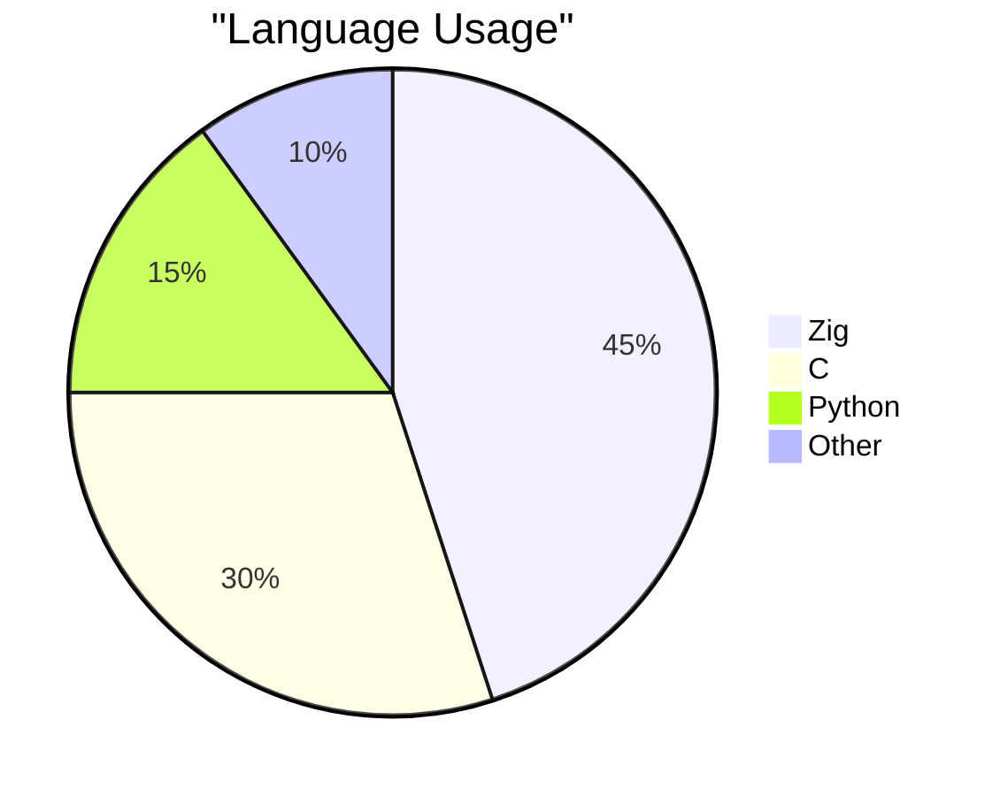
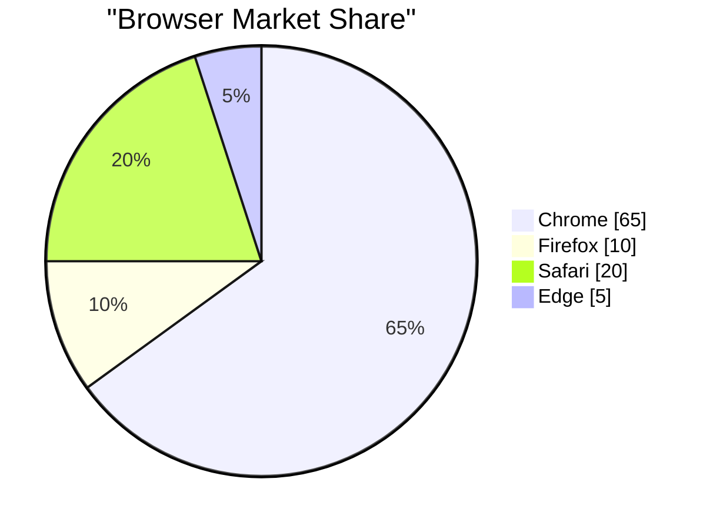
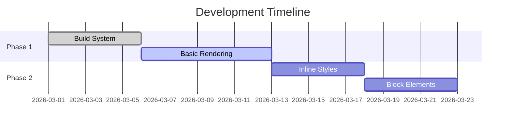
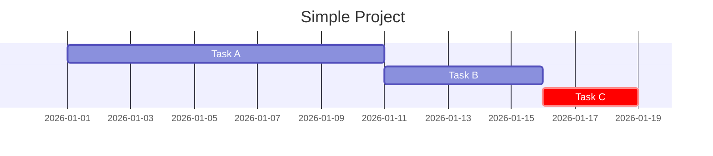

# Phase 8 Test: Pie & Gantt Charts

## Pie Chart

```mermaid
pie title "Language Usage"
    "Zig" : 45
    "C" : 30
    "Python" : 15
    "Other" : 10
```

## Pie Chart with showData

```mermaid
pie showData
    title "Browser Market Share"
    "Chrome" : 65
    "Firefox" : 10
    "Safari" : 20
    "Edge" : 5
```

## Gantt Chart

```mermaid
gantt
    title Development Timeline
    dateFormat YYYY-MM-DD
    section Phase 1
    Build System    :done, bs, 2026-03-01, 5d
    Basic Rendering :active, br, after bs, 7d
    section Phase 2
    Inline Styles   :is, after br, 5d
    Block Elements  :be, after is, 5d
```

## Simple Gantt

```mermaid
gantt
    title Simple Project
    dateFormat YYYY-MM-DD
    Task A :a1, 2026-01-01, 10d
    Task B :a2, after a1, 5d
    Task C :crit, a3, after a2, 3d
```
