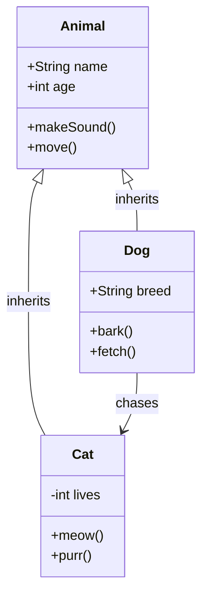
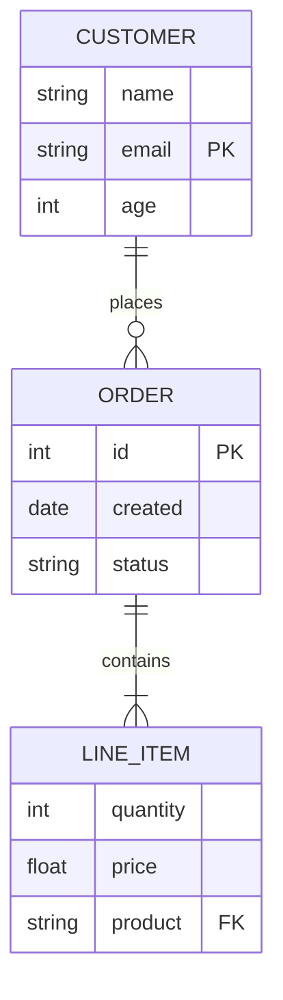
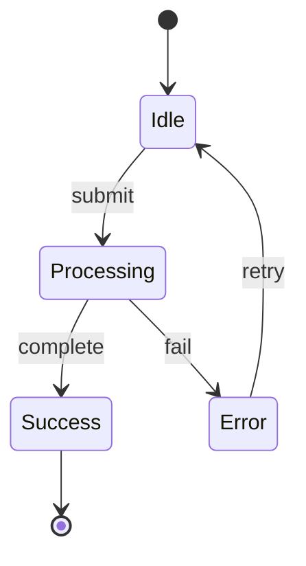

# Phase 9 Test — Class, ER, and State Diagrams

## Class Diagram

```mermaid
classDiagram
    class Animal {
        +String name
        +int age
        +makeSound()
        +move()
    }
    class Dog {
        +String breed
        +bark()
        +fetch()
    }
    class Cat {
        -int lives
        +meow()
        +purr()
    }
    Animal <|-- Dog : inherits
    Animal <|-- Cat : inherits
    Dog --> Cat : chases
```

## ER Diagram

```mermaid
erDiagram
    CUSTOMER ||--o{ ORDER : places
    ORDER ||--|{ LINE_ITEM : contains
    CUSTOMER {
        string name
        string email PK
        int age
    }
    ORDER {
        int id PK
        date created
        string status
    }
    LINE_ITEM {
        int quantity
        float price
        string product FK
    }
```

## State Diagram

```mermaid
stateDiagram-v2
    [*] --> Idle
    Idle --> Processing : submit
    Processing --> Success : complete
    Processing --> Error : fail
    Error --> Idle : retry
    Success --> [*]
```
