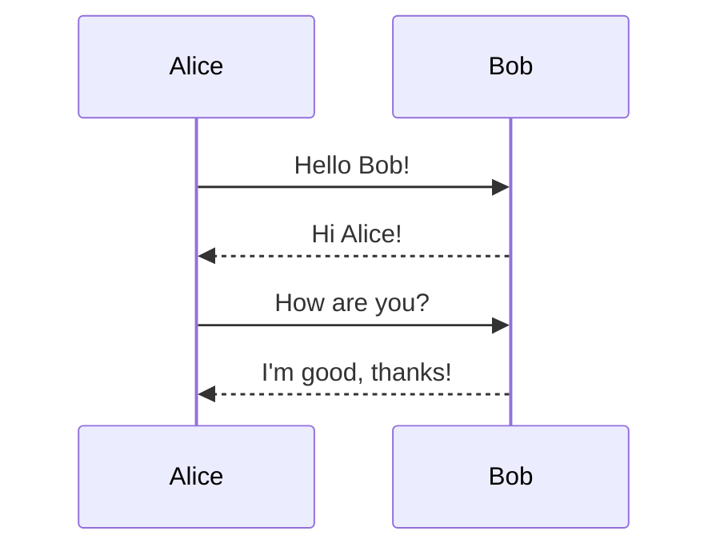
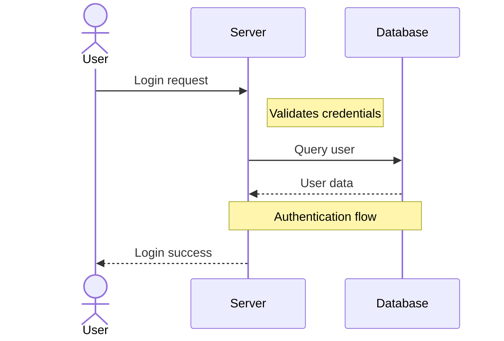
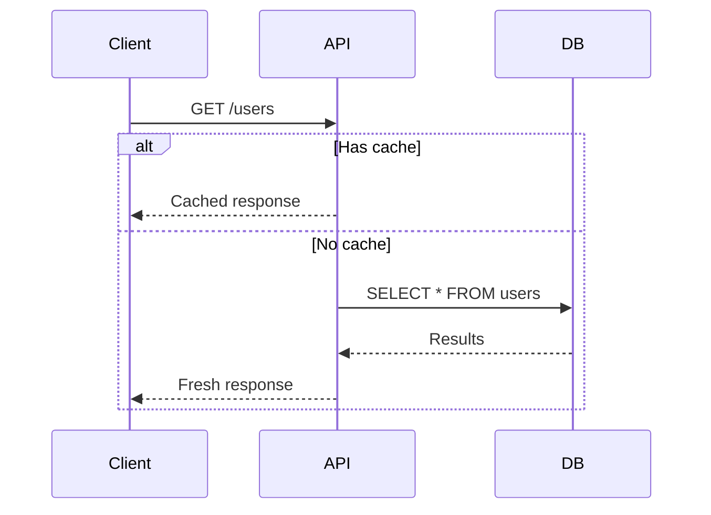
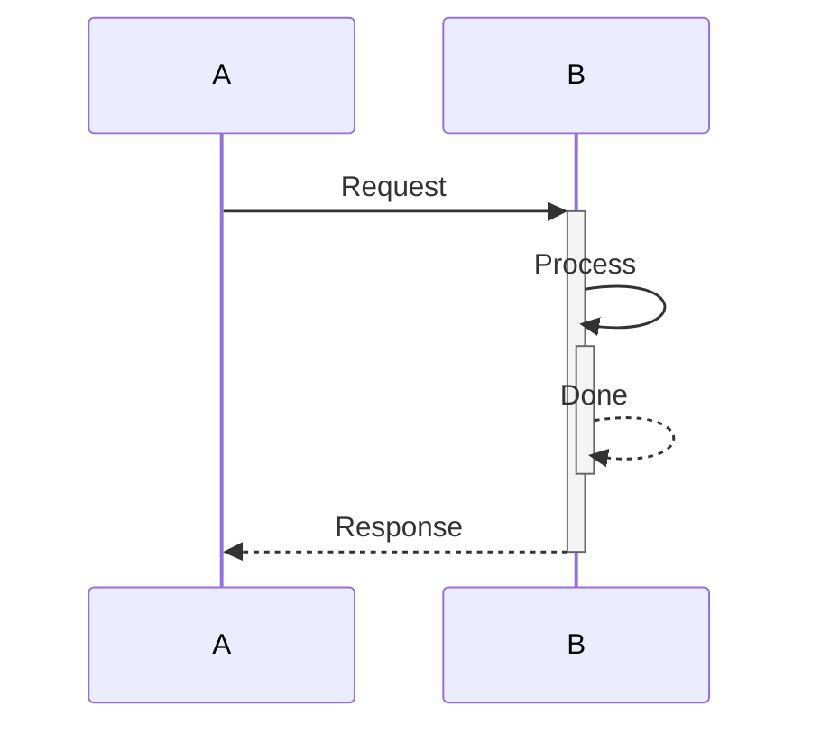

# Sequence Diagram Test

## Basic Sequence

```mermaid
sequenceDiagram
    participant Alice
    participant Bob
    Alice->>Bob: Hello Bob!
    Bob-->>Alice: Hi Alice!
    Alice->>Bob: How are you?
    Bob-->>Alice: I'm good, thanks!
```

## With Actors and Notes

```mermaid
sequenceDiagram
    actor User
    participant Server
    participant DB as Database
    User->>Server: Login request
    Note right of Server: Validates credentials
    Server->>DB: Query user
    DB-->>Server: User data
    Note over Server,DB: Authentication flow
    Server-->>User: Login success
```

## Alt/Else Blocks

```mermaid
sequenceDiagram
    participant Client
    participant API
    participant DB
    Client->>API: GET /users
    alt Has cache
        API-->>Client: Cached response
    else No cache
        API->>DB: SELECT * FROM users
        DB-->>API: Results
        API-->>Client: Fresh response
    end
```

## Activation

```mermaid
sequenceDiagram
    participant A
    participant B
    A->>+B: Request
    B->>+B: Process
    B-->>-B: Done
    B-->>-A: Response
```
