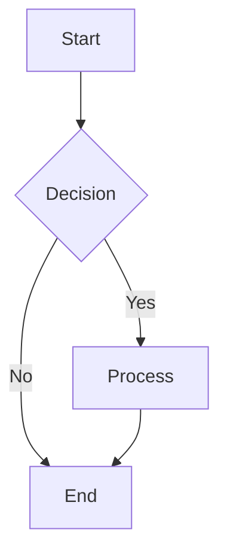
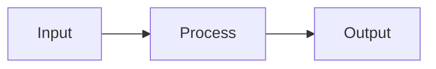
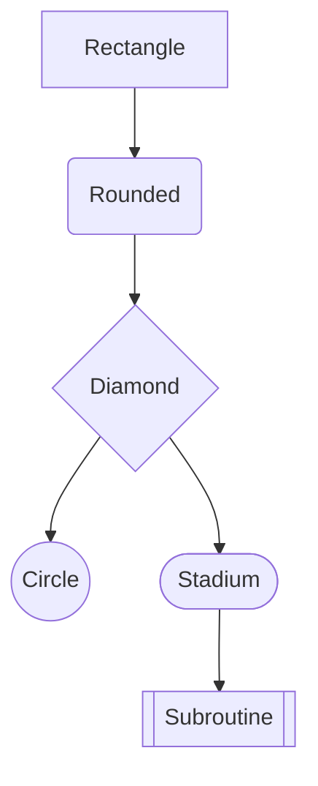
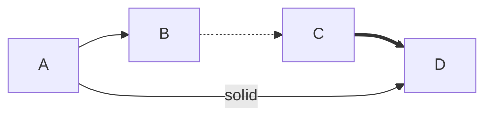
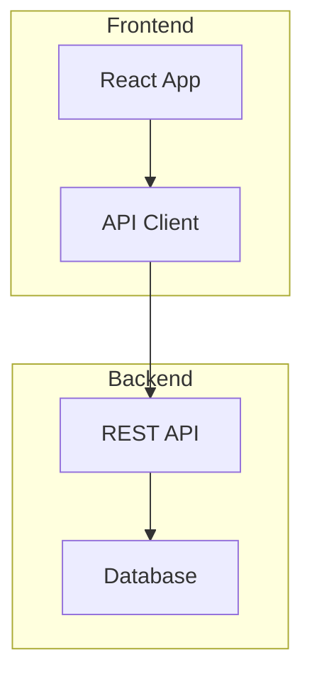
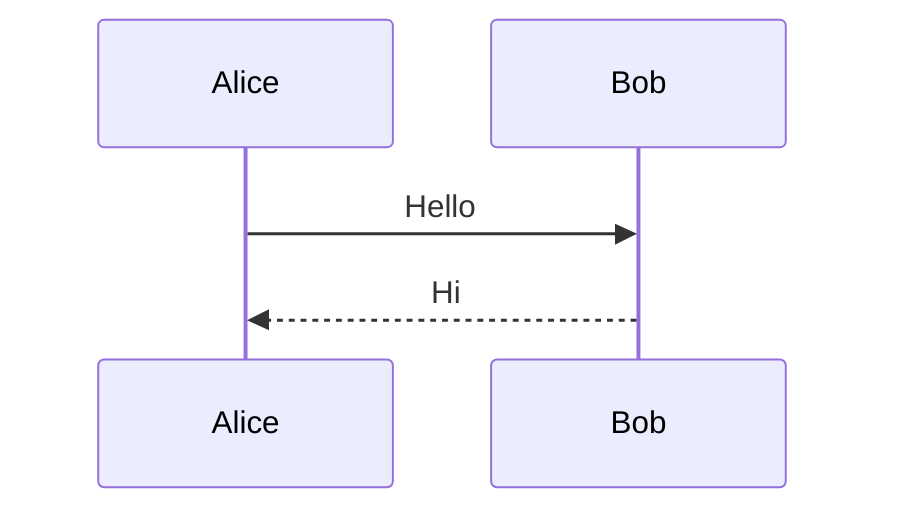

# Phase 6: Mermaid Flowchart Tests

## Basic Flowchart (TD)



## Left-to-Right Direction



## Multiple Node Shapes



## Edge Labels and Styles



## Subgraphs



## Unsupported Diagram Type



## Regular Code Block (should still render normally)

```python
def hello():
    print("This is not a mermaid diagram")
```
